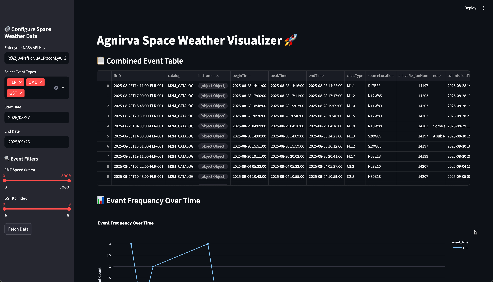
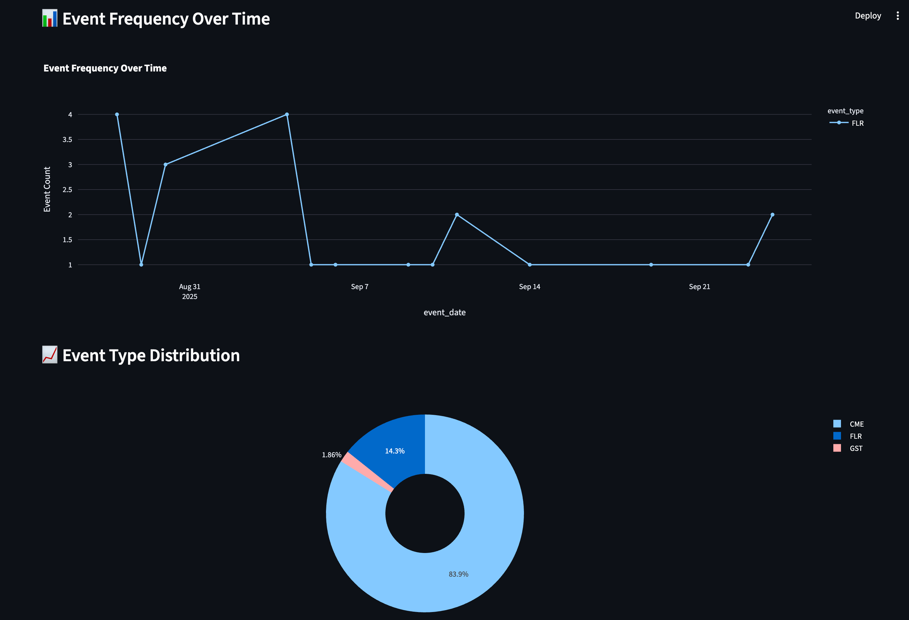

  


# 🚀 Agnirva Space Weather Visualizer  

> A Streamlit-based dashboard that visualizes NASA’s **space weather data** including Solar Flares (FLR), Coronal Mass Ejections (CME), and Geomagnetic Storms (GST).  
> Built as part of the **Agnirva Internship Capstone Project**.  

---

## 🌌 Features  

- ✅ Fetch real-time data from NASA’s DONKI API  
- ✅ Interactive visualizations with Plotly (line charts, bar charts, pie charts)  
- ✅ Event filtering by type (FLR, CME, GST) and date range  
- ✅ Export data to **CSV** or **Excel** for offline analysis  
- ✅ Raw JSON viewer for detailed inspection  
- ✅ Responsive UI with a clean Streamlit interface  

---

## 🛠️ Technologies Used  

- **Python 3.10+**  
- **Streamlit** (UI framework)  
- **Plotly Express** (visualizations)  
- **Pandas** (data manipulation)  
- **NASA DONKI API** (data source)  
- **XlsxWriter** (Excel export)  

---

## ⚡ Setup Instructions  

### 1️⃣ Clone Repository  
```bash
git clone https://github.com/yashbhilare21/SpaceWeatherVisualizer.git
cd SpaceWeatherVisualizer
```
### 2️⃣ Install Dependencies
```bash
pip install -r requirements.txt
```
### 3️⃣ Run the App
```bash
streamlit run app.py
```

## 🔑 NASA API Key  

This project uses NASA’s **DONKI API**.  

- Get a free API key: [https://api.nasa.gov/](https://api.nasa.gov/)  
- Enter it in the Streamlit sidebar when prompted.  

---

## 🌍 Live Demo  

👉 [View Deployed App](https://space-weather-visualizer-agnirva.streamlit.app/)  

---

## 📸 Screenshots  

### Dashboard Home  


### Event Frequency Chart  


---

## 📜 Progress Log  

- **Week 8, Day 1:** Capstone Development – Part 1 (Basic setup & NASA API integration)  
- **Week 8, Day 2:** Capstone Development – Part 2 (Data cleaning, initial visualizations)  
- **Week 8, Day 3:** Capstone Development – Part 3 (Export options, JSON viewer, frequency charts)  
- **Week 8, Day 4:** Final Testing & Deployment (UI polish, deployment, GitHub cleanup)  
- **Week 8, Day 5:** Demo Day 🎉  

For detailed daily progress, see [Progress Log](progress.md)

---

## 🙌 Acknowledgments  

- NASA for providing the **DONKI API**  
- Agnirva Internship Team for mentorship and guidance  
- [Streamlit](https://streamlit.io/) & [Plotly](https://plotly.com/) for powerful visualization tools  

---

## 📄 License  

This project is licensed under the **MIT License**.  

